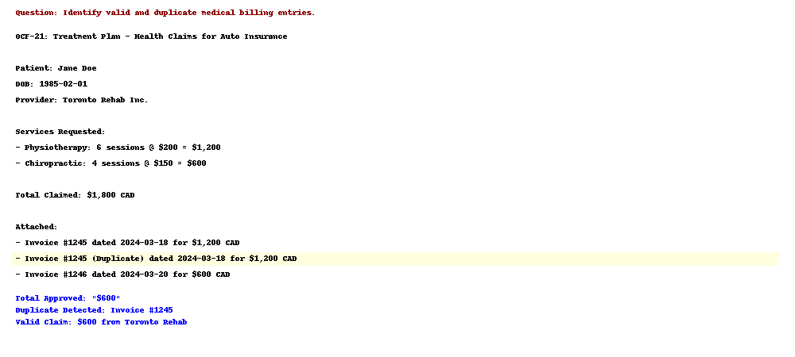

# 🏥💸 Insurance Claim Auditor – Medical Timeline & Fraud Detection with LLMs

This project simulates an advanced LLM-based pipeline for insurance claim analysis, specifically targeting Ontario Claim Forms (OCFs), medical invoices, and duplicate billing detection.

The system combines fast inference with Hugging Face Phi-3.5 and structured JSON generation using fine-tuned LLaMA, and is deployable to Amazon SageMaker.

---

## 🚀 Key Features

- Extracts chronological medical events from unstructured documents
- Parses OCF-21, OCF-18 and OCF-23 forms to extract claimed amounts
- Identifies invoices and maps them to treatment categories
- Detects duplicate or overlapping billings for fraud prevention
- Outputs standardized JSON for downstream audit tools

---

## 🧾 Example JSON Output

```json
{
  "valid_claims": [
    { "amount": "$1,200", "provider": "Toronto Rehab", "service": "Physio", "date": "2024-03-18" }
  ],
  "flagged_duplicates": [
    { "amount": "$1,200", "provider": "Toronto Rehab", "date": "2024-03-18", "reason": "Duplicate of Invoice #1245" }
  ],
  "total_approved": "$1,200"
}
```

---

## 🧠 Models Used

- 🔹 Hugging Face Phi-3.5 for fast document understanding
- 🔹 Fine-Tuned LLaMA for structured JSON output extraction
- 🔹 Amazon SageMaker deployment for secure, scalable serving

---

## 📁 Structure

```
insurance-claim-auditor/
├── data/
│   ├── sample_documents/       # Sample OCFs, invoices, PDFs
│   └── extracted_json/         # Processed claim output in JSON
├── auditor_engine/
│   ├── claim_parser.py         # Core logic to extract claim fields
│   ├── duplicate_checker.py    # Logic to detect invoice overlap
│   └── prompt_templates.yaml   # LLaMA prompts for consistent outputs
├── notebooks/
│   └── claim_audit_demo.ipynb  # Demo pipeline with test case
├── README.md
└── requirements.txt
```


---

## 🖼️ Visual Demo

### Prompt-to-Response Example




---

Made with ❤️ by Rahul Chatterjee
